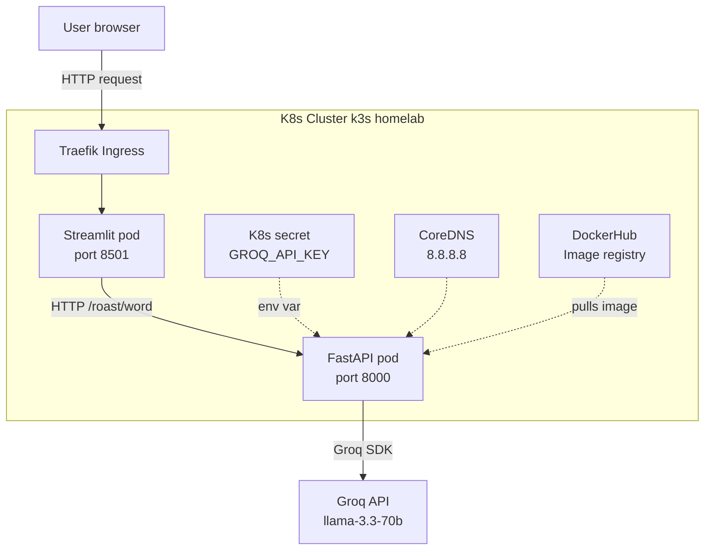

WordBurner 🔥

Vocabulary learning with zero mercy 😂

An AI-powered vocabulary learning app that teaches English words through sarcastic roast-style explanations. Built with a proper microservices architecture and deployed on Kubernetes.

What it does
Type any English word and WordBurner will:

Roast you for not knowing it 😂
Teach you the meaning, synonyms, antonyms
Show phonetic pronunciation
Give memory tricks and word origin
Navigate through flashcards (no endless scrolling)
Surprise you with a new word by difficulty level

Tech Stack
LayerTechnologyFrontendStreamlit (Python)BackendFastAPI (Python)AIGroq API — llama-3.3-70b-versatilePronunciationgTTS + dictionaryapi.devContainerizationDocker (multi-stage builds)OrchestrationKubernetes (k3s homelab)IngressTraefikRegistryDockerHub

Architecture
User (browser)
      ↓ HTTP
Traefik Ingress (k3s)
      ↓
Streamlit Pod (port 8501)
      ↓ HTTP /roast/{word}
FastAPI Pod (port 8000)
      ↓ Groq SDK
Groq API (external)

Project Structure
WordBurner/
├── main.py                  # FastAPI backend
├── roast.py                 # Groq AI logic + prompts
├── streamlit_app.py         # Streamlit frontend
├── requirements.txt         # Python dependencies
├── Dockerfile.fastapi       # Multi-stage Docker build
├── Dockerfile.streamlit     # Multi-stage Docker build
├── .dockerignore            # Excludes venv, secrets
├── .gitignore               # Excludes .env, venv
└── k8s/
    ├── secret.yaml.example  # Secret template (no real keys)
    ├── fastapi-deployment.yaml
    ├── fastapi-service.yaml
    ├── streamlit-deployment.yaml
    ├── streamlit-service.yaml
    └── ingress.yaml

Local Setup
bash# Clone repo
git clone https://github.com/anishka-saxena/WordBurner.git
cd WordBurner

# Create virtual environment
python3 -m venv venv
source venv/bin/activate

# Install dependencies
pip install -r requirements.txt

# Create .env file
echo "GROQ_API_KEY=your_key_here" > .env

# Terminal 1 - Start FastAPI
uvicorn main:app --reload --host 0.0.0.0 --port 8000

# Terminal 2 - Start Streamlit
streamlit run streamlit_app.py
Open http://localhost:8501 🔥

Docker Setup
bash# Build images
docker build -f Dockerfile.fastapi -t wordburner-fastapi:v1 .
docker build -f Dockerfile.streamlit -t wordburner-streamlit:v1 .

# Run FastAPI
docker run -p 8000:8000 -e GROQ_API_KEY=your_key wordburner-fastapi:v1

# Run Streamlit
docker run -p 8501:8501 -e FASTAPI_URL=http://host.docker.internal:8000 wordburner-streamlit:v1

Kubernetes Deployment
bash# Create namespace
kubectl create namespace wordburner

# Create secret (encode key first)
echo -n "your_groq_key" | base64
# paste output into k8s/secret.yaml

# Deploy everything
kubectl apply -f k8s/secret.yaml
kubectl apply -f k8s/fastapi-deployment.yaml
kubectl apply -f k8s/fastapi-service.yaml
kubectl apply -f k8s/streamlit-deployment.yaml
kubectl apply -f k8s/streamlit-service.yaml
kubectl apply -f k8s/ingress.yaml

# Verify
kubectl get all -n wordburner

Key Learnings

Proper microservices separation (FastAPI + Streamlit as distinct services)
Multi-stage Docker builds for smaller images
K8s secrets management (never commit secrets to Git!)
CoreDNS configuration for external DNS resolution
Traefik ingress controller setup
Session state management in Streamlit
LLM prompt engineering for consistent output format
Temperature parameter for randomness in AI responses

Roadmap

 Redis for persistent word history
 CI/CD pipeline with GitHub Actions
 Oracle Cloud free tier deployment
 Cloudflare tunnel for public access
 Word history and favourites feature

Author
Anishka Saxena — CKA Certified DevOps Engineer learning AI Development

